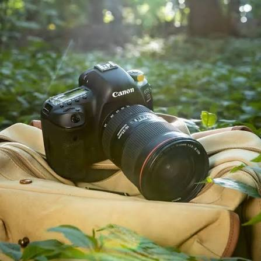

# Photography Assignment

A simple photography-themed website built with HTML and CSS.

## Features
- A welcoming homepage layout
- A short biography section
- A gallery of featured images
- A stylish black-and-gold visual theme

## How to View
1. Open the project folder in a browser.
2. Open the index.html file to view the website.

## Files
- index.html: Main webpage content
- style.css: Styling and layout

## Author
Created as a web design assignment by Ethan Kamau.
## Tools Used
- CSS
- HTML

## Images used

